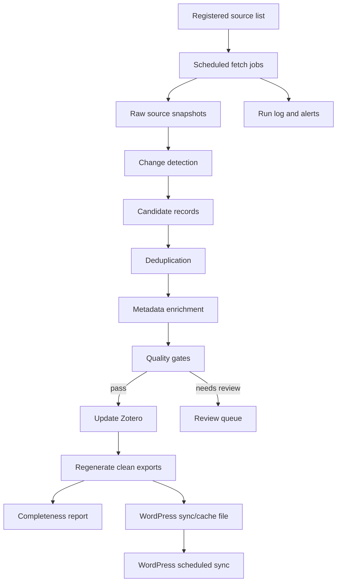

# Phase 2 Automation Architecture

## 1. Target workflow



## 2. Source layers

### Layer 1: Zotero source of truth

Zotero remains the primary integration source for WordPress.

Current tested endpoints:

```text
GET https://api.zotero.org/users/21117133/collections?format=json
GET https://api.zotero.org/users/21117133/collections/VNEB8Z2T/items?format=json&include=data
GET https://api.zotero.org/users/21117133/collections/CI4SRMX3/items?format=json&include=data
GET https://api.zotero.org/users/21117133/collections/Q3ZM44NE/items?format=json&include=data
```

Automation should read existing Zotero records by stable IDs in `data.extra`:

| Collection | Stable ID field |
|---|---|
| `01 Catalogue Sources` | `NeuroNZ Record ID` |
| `02 Evidence Log` | `NeuroNZ Evidence ID` |
| `03 Condition Taxonomy` | `NeuroNZ Condition ID` |

### Layer 2: Local controlled exports

The cleaned exports remain useful for validation, dissertation evidence, and fallback QA:

```text
NeuroNZ-Phase1-Collection/catalogue_phase1_clean.csv
NeuroNZ-Phase1-Collection/evidence_log_phase1_clean.csv
NeuroNZ-Phase1-Collection/condition_taxonomy_phase1_clean.csv
NeuroNZ-Phase1-Collection/excluded_sources_phase1_clean.csv
```

### Layer 3: External monitored sources

External sources are monitored to detect new or changed catalogue/evidence candidates. See `source_registry.csv`.

## 3. Recommended pipeline stages

### Stage 1: Source fetch

Each source job should save:

| Field | Meaning |
|---|---|
| `run_id` | Unique automation run identifier |
| `source_id` | Source registry identifier |
| `source_name` | Human-readable source |
| `fetch_method` | API, RSS, sitemap, page monitor, Zotero API |
| `fetched_at` | Timestamp |
| `status_code` | HTTP status or tool status |
| `raw_result_count` | Number of records or links observed |
| `error_message` | Failure detail when a source fails |

### Stage 2: Candidate extraction

Convert raw source results into candidate records with:

| Field | Required? |
|---|---:|
| `candidate_id` | Yes |
| `source_id` | Yes |
| `title` | Yes |
| `url` | Yes |
| `source_organisation` | Yes |
| `detected_at` | Yes |
| `candidate_type` | Yes |
| `doi` | When available |
| `pmid` | When available |
| `summary` | When available |
| `condition_terms` | When available |

### Stage 3: Deduplication

Deduplicate in this order:

1. DOI,
2. PMID or PMCID,
3. Zotero key,
4. stable NeuroNZ ID,
5. canonical URL,
6. normalised title plus source organisation plus year.

Deduplication results should be logged as:

| Status | Meaning |
|---|---|
| `new_candidate` | No match found. |
| `changed_existing` | Existing record found and metadata changed. |
| `unchanged_existing` | Existing record found and no material change. |
| `possible_duplicate` | Similarity is high but not safe enough to merge automatically. |

### Stage 4: Metadata enrichment

Automated enrichment should fill or update:

1. `zotero_key`,
2. `doi`,
3. `pmid`,
4. `primary_link`,
5. `source_category`,
6. `type_of_data`,
7. `age_group`,
8. `main_neuro_type`,
9. `available_in_idi`,
10. `last_verified`,
11. `review_status`,
12. evidence `record_id` links.

### Stage 5: Quality gates

Records that pass gates can update Zotero and exports. Records that fail should go to a review queue. See `quality_gates.md`.

### Stage 6: Zotero update

Use the existing importer/updater pattern:

```bash
ZOTERO_API_KEY="$ZOTERO_API_KEY" python3 scripts/zotero_phase1_import.py \
  --clean \
  --include-evidence \
  --include-conditions \
  --update-existing \
  --root-collection "NeuroNZ Collection"
```

Phase 2 should extend this with a backfill/export step rather than creating duplicate records.

### Stage 7: WordPress sync support

WordPress should continue syncing from Zotero. Phase 2 should provide:

| Output | Purpose |
|---|---|
| `zotero_cache.json` | Cached Zotero API response shaped for WordPress. |
| `wordpress_sync_report.json` | Counts, errors, and changed IDs for the latest refresh. |
| `catalogue_completeness_report.csv` | Field coverage after each run. |
| `review_queue.csv` | Records blocked from publication. |

## 4. Scheduling recommendation

| Job | Suggested cadence |
|---|---|
| Zotero-to-export completeness check | Daily during development, weekly after launch |
| Link checker | Weekly |
| Source monitors | Weekly |
| Bibliographic source checks | Monthly |
| Full taxonomy synonym/classification refresh | Monthly or milestone-based |
| WordPress sync | Daily or weekly, plus manual admin trigger |

## 5. Auditability

Every automation run should create a timestamped run folder:

```text
Phase2-Automation/runs/YYYY-MM-DD-HHMM/
```

Each run folder should contain:

| File | Purpose |
|---|---|
| `run_summary.json` | Overall run result. |
| `source_fetch_log.csv` | Source fetch status. |
| `new_candidates.csv` | New records found. |
| `changed_records.csv` | Existing records changed. |
| `duplicate_matches.csv` | Deduplication outcomes. |
| `validation_failures.csv` | Records blocked by quality gates. |
| `zotero_update_manifest.csv` | Zotero records created or updated. |
| `completeness_report.csv` | Post-run field coverage. |

